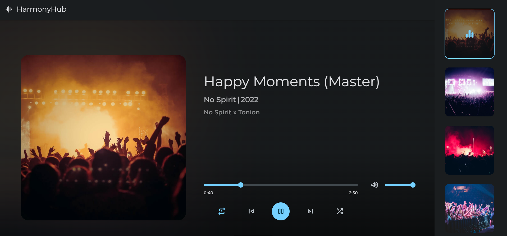

# HexSoftwares_Web_Music_Player
## HarmonyHub Music Player

HarmonyHub is a sleek and intuitive web music player built using HTML, CSS, and JavaScript. It allows you to listen to your favorite tunes, create playlists, and enjoy a seamless music experience right in your browser.

## Features
Play and Pause: Control playback with a simple click.
Next and Previous: Easily switch between tracks.
Volume Control: Adjust the volume to your liking.
Track Details: Display track information, including artist and album.
Responsive Design: Enjoy HarmonyHub on any device.

### Screenshots

### Getting Started

Clone this repository:
git clone https://github.com/VanshArora16/HexSoftwares_Web_Music_Player.git

Open index.html in your preferred web browser.

# Usage
Add your favorite songs to the playlist.
Click play to start the music.
Use the next and previous buttons to switch tracks.
Adjust the volume slider as needed.

### Contributing
Contributions are welcome! If you’d like to enhance HarmonyHub, feel free to fork this repository and submit pull requests.